# Домашнее задание к занятию "`Основы Git`" - `Дедюрин Денис`

## Задание 1. Знакомимся с GitLab и Bitbucket

Создаем репозиторий в GitLab (адрес: https://gitlab.com/omegavlg/devops-netology):
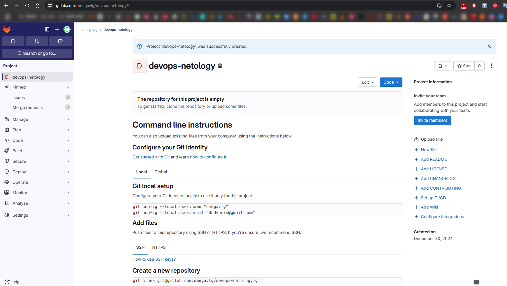

Переходим к репозиторию из прошлого задания и выполняем команды:
```
git remote -v
```
и
```
git remote add gitlab https://gitlab.com/omegavlg/devops-netology.git
```
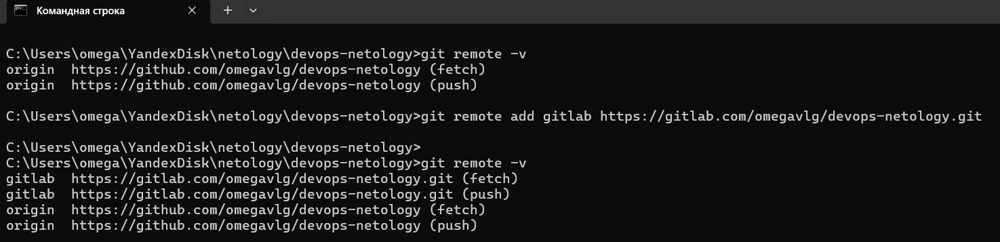

После второго вызова команды git remote -v мы видим, что к уже существующему удаленному репозиторию origin, указывающему на GitHub, добавился новый удаленный репозиторий gitlab, указывающий на GitLab. Теперь у нас настроены два удаленных репозитория для одного локального проекта, и мы можем взаимодействовать с обоими.

Чтобы отправить изменения в новый удаленный репозиторий, выполняем команду:
```
git push -u gitlab main
```
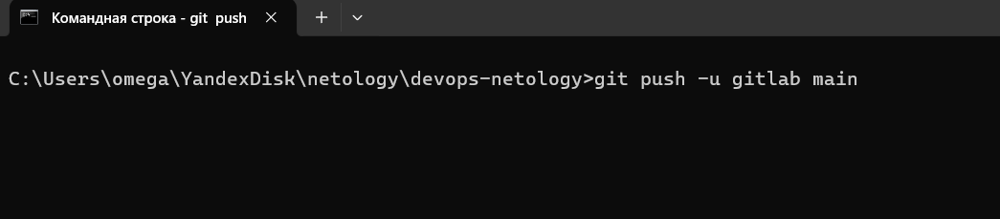
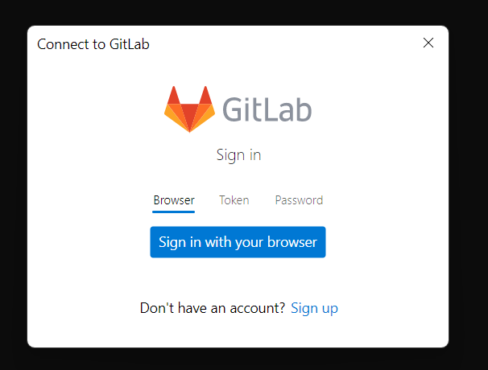
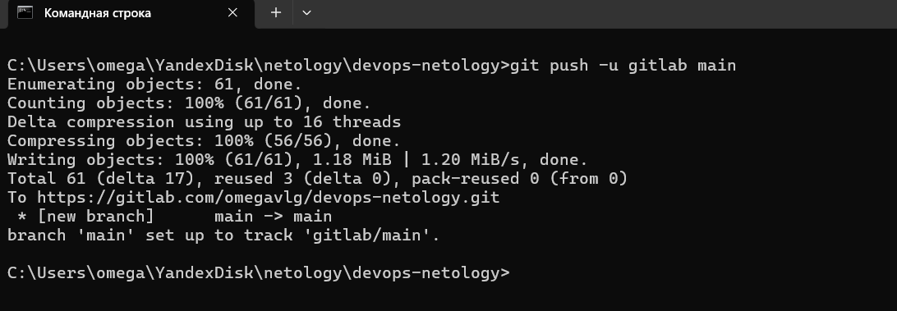

Видим, что изменения опубликованы в GitLab.
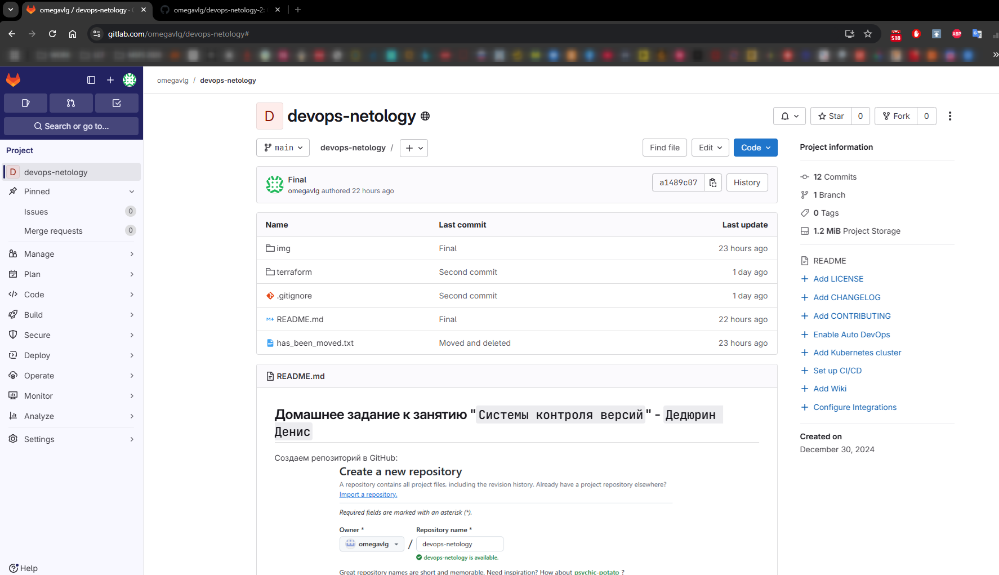

## Задание 2. Теги

Представьте ситуацию, когда в коде была обнаружена ошибка — надо вернуться на предыдущую версию кода, исправить её и выложить исправленный код в продакшн. Мы никуда не будем выкладывать код, но пометим некоторые коммиты тегами и создадим от них ветки.

1. Создайте легковестный тег v0.0 на HEAD-коммите и запуште его во все три добавленных на предыдущем этапе upstream.
1. Аналогично создайте аннотированный тег v0.1.
1. Перейдите на страницу просмотра тегов в GitHab (и в других репозиториях) и посмотрите, чем отличаются созданные теги.
* в GitHub — https://github.com/omegavlg/devops-netology/tags;
* в GitLab — https://gitlab.com/omegavlg/devops-netology/-/tags;
* в Bitbucket — список тегов расположен в выпадающем меню веток на отдельной вкладке.

### Ответ:

Создаем тег v0.0 и запушим его в репозитории origin и gitLab командами:
```
git tag v0.0
git push origin v0.0
git push gitlab v0.0
```
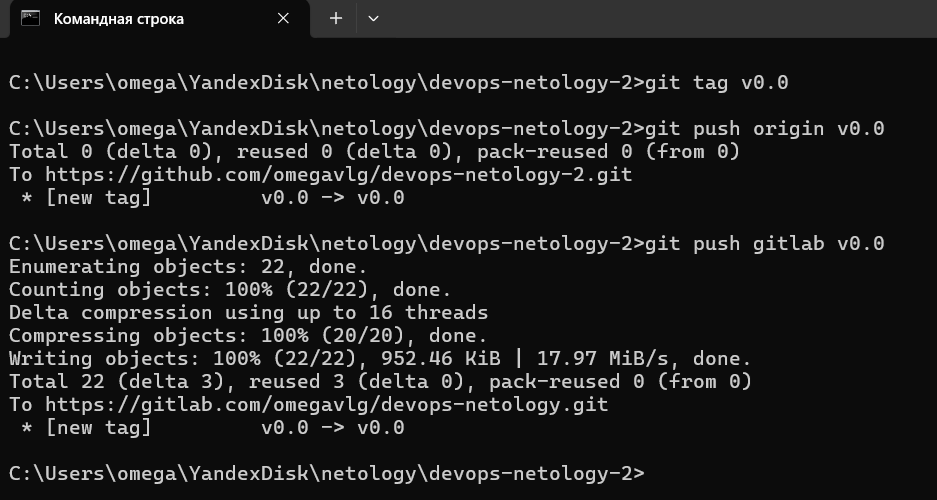

Создаем аннотированный тег v0.1 и также пушим его в удаленные репозитории командами:
```
git tag -a v0.1 -m "Release 0.1"
git push origin v0.1
git push gitlab v0.1
```
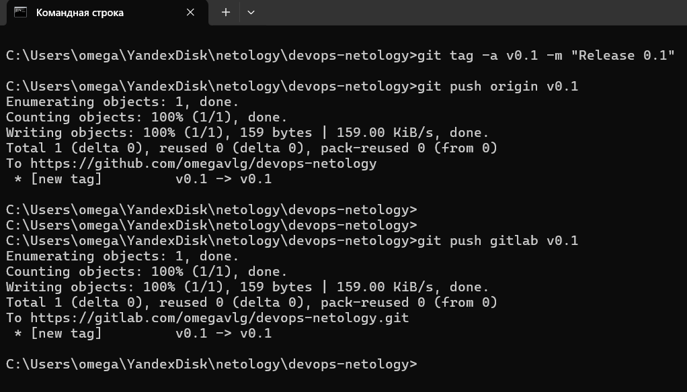

После пуша тегов видим, что:

GitHub: Аннотированные и легковесные теги отображаются как простой указатель на коммит.


GitLab: Аннотированные теги будут содержать сообщение, а легковесные — нет.
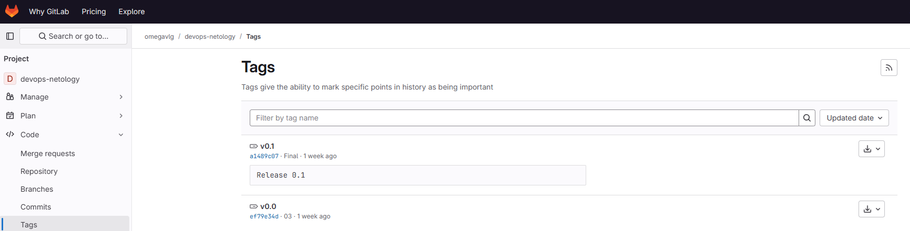

## Задание 3. Ветки
Давайте посмотрим, как будет выглядеть история коммитов при создании веток.

1. Переключитесь обратно на ветку main, которая должна быть связана с веткой main репозитория на github.
1. Посмотрите лог коммитов и найдите хеш коммита с названием Prepare to delete and move, который был создан в пределах предыдущего домашнего задания.
1. Выполните git checkout по хешу найденного коммита.
1. Создайте новую ветку fix, базируясь на этом коммите git switch -c fix.
1. Отправьте новую ветку в репозиторий на GitHub git push -u origin fix.
1. Посмотрите, как визуально выглядит ваша схема коммитов: https://github.com/YOUR_ACCOUNT/devops-netology/network.
1. Теперь измените содержание файла README.md, добавив новую строчку.
1. Отправьте изменения в репозиторий и посмотрите, как изменится схема на странице https://github.com/YOUR_ACCOUNT/devops-netology/network и как изменится вывод команды git log.

### Ответ:
Переключаемся в ветку main и выводим лог коммитов:
```
git checkout main
git log --oneline
```
Нас интересует коммит с хешем 07с9с65

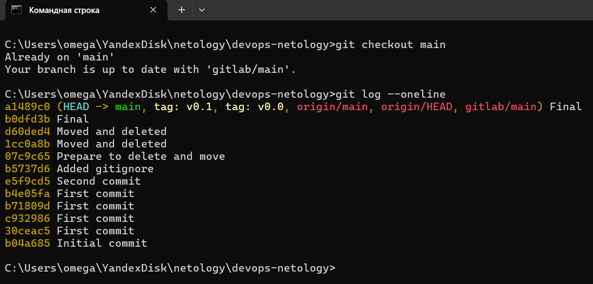

Переключаемся на коммит:
```
git checkout 07c9c65
```
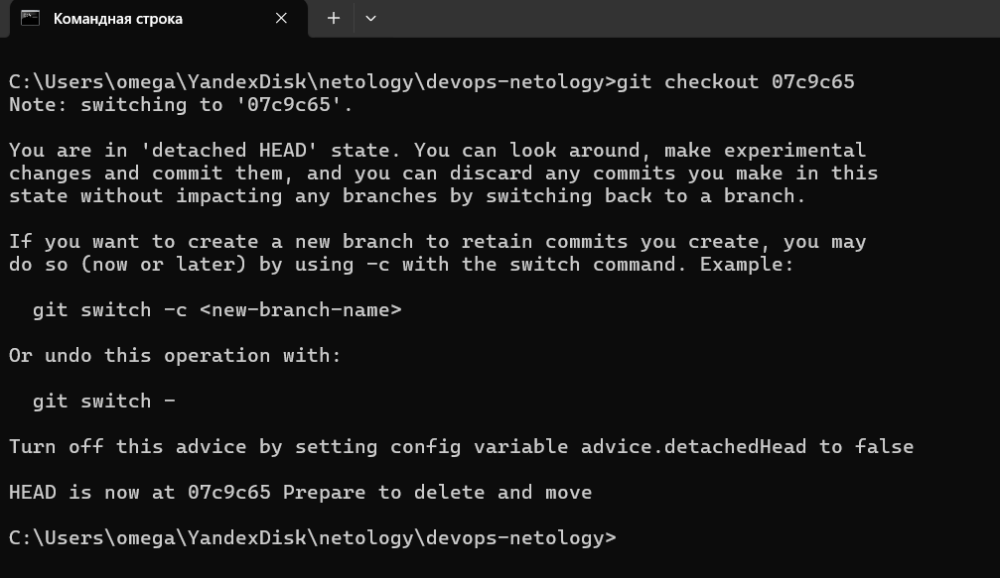

Создаем новую ветку fix и пушим ветку в репозиторий:
```
git switch -c fix
git push -u origin fix
```
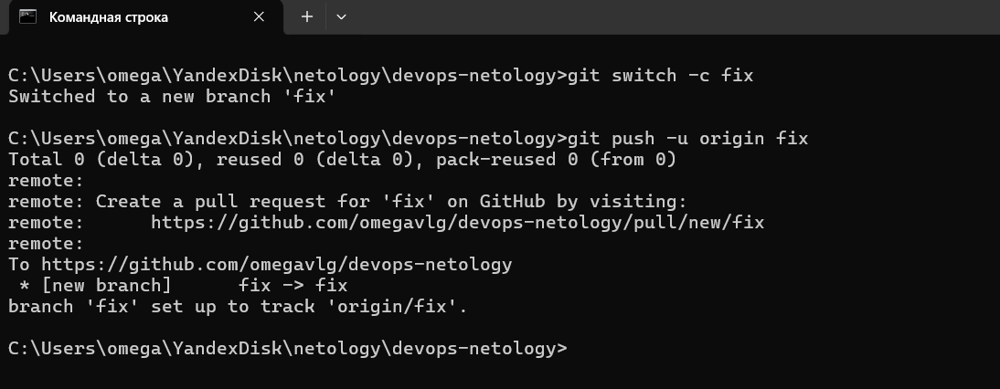

Смотрим, как визуально выглядит схема коммитов https://github.com/omegavlg/devops-netology/network:
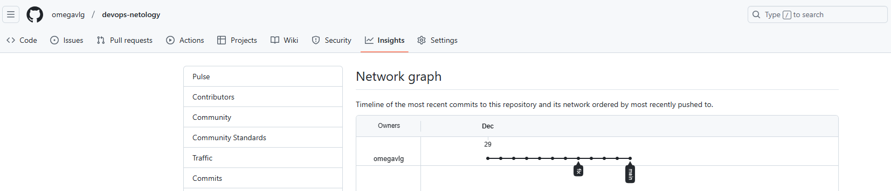

Добавим новую строчку в файл README.md проекта и отправляем изменения в репозиторий:
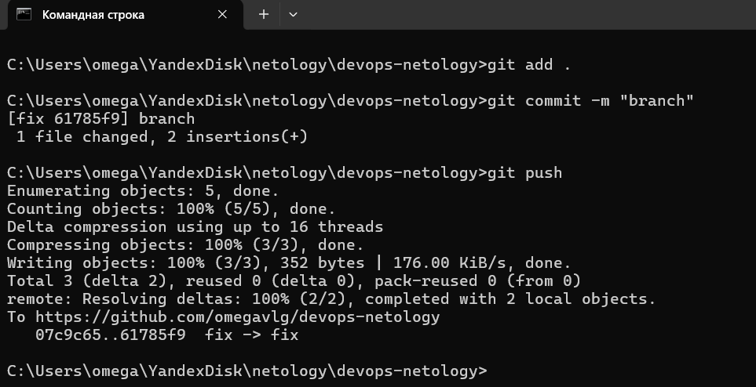

Проверяем, как изменилась схема коммитов https://github.com/omegavlg/devops-netology/network:
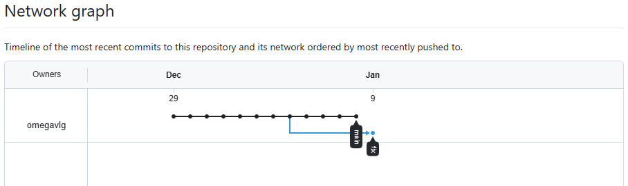

А также как изменится вывод команды git log
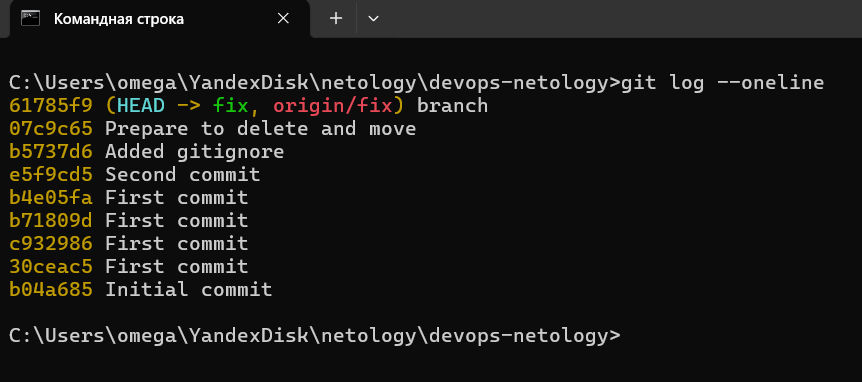

## Задание 4. Упрощаем себе жизнь

Попробуем поработь с Git при помощи визуального редактора.

1. В используемой IDE PyCharm откройте визуальный редактор работы с Git, находящийся в меню View -> Tool Windows -> Git.

1. Измените какой-нибудь файл, и он сразу появится на вкладке Local Changes, отсюда можно выполнить коммит, нажав на кнопку внизу этого диалога.

1. Элементы управления для работы с Git будут выглядеть примерно так:

Работа с гитом

1. Попробуйте выполнить пару коммитов, используя IDE.

По ссылке можно найти справочную информацию по визуальному интерфейсу.

Если вверху экрана выбрать свою операционную систему, можно посмотреть горячие клавиши для работы с Git. Подробней о визуальном интерфейсе мы расскажем на одной из следующих лекций.

В качестве результата работы по всем заданиям приложите ссылки на ваши репозитории в GitHub, GitLab и Bitbucket.

### Ответ:

Не особо получилось работать с этим инструментом. Показался мне неудобным на текущий момент.
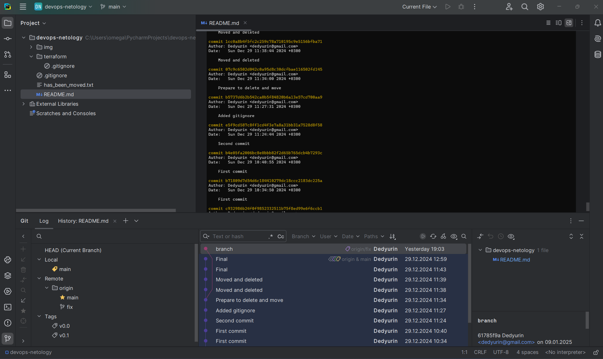
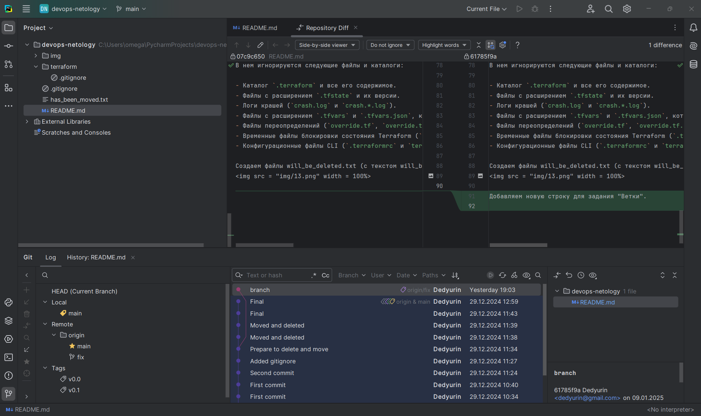