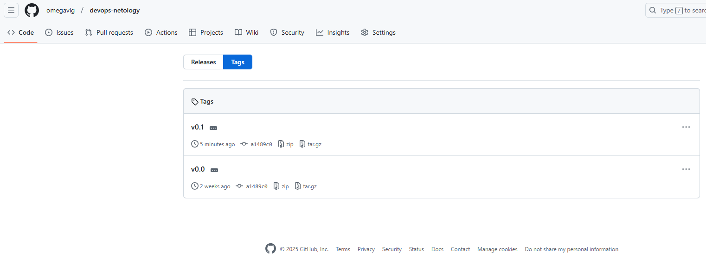

# Домашнее задание к занятию "`Основы Git`" - `Дедюрин Денис`

## Задание 1. Знакомимся с GitLab и Bitbucket

Создаем репозиторий в GitLab (адрес: https://gitlab.com/omegavlg/devops-netology):


Переходим к репозиторию из прошлого задания и выполняем команды:
```
git remote -v
```
и
```
git remote add gitlab https://gitlab.com/omegavlg/devops-netology.git
```


После второго вызова команды git remote -v мы видим, что к уже существующему удаленному репозиторию origin, указывающему на GitHub, добавился новый удаленный репозиторий gitlab, указывающий на GitLab. Теперь у нас настроены два удаленных репозитория для одного локального проекта, и мы можем взаимодействовать с обоими.

Чтобы отправить изменения в новый удаленный репозиторий, выполняем команду:
```
git push -u gitlab main
```


Видим, что изменения опубликованы в GitLab.


## Задание 2. Теги

Представьте ситуацию, когда в коде была обнаружена ошибка — надо вернуться на предыдущую версию кода, исправить её и выложить исправленный код в продакшн. Мы никуда не будем выкладывать код, но пометим некоторые коммиты тегами и создадим от них ветки.

Создайте легковестный тег v0.0 на HEAD-коммите и запуште его во все три добавленных на предыдущем этапе upstream.
Аналогично создайте аннотированный тег v0.1.
Перейдите на страницу просмотра тегов в GitHab (и в других репозиториях) и посмотрите, чем отличаются созданные теги.
* в GitHub — https://github.com/omegavlg/devops-netology/tags;
* в GitLab — https://gitlab.com/omegavlg/devops-netology/-/tags;
* в Bitbucket — список тегов расположен в выпадающем меню веток на отдельной вкладке.

### Ответ:

Создаем тег v0.0 и запушим его в репозитории origin и gitLab командами:
```
git tag v0.0
git push origin v0.0
git push gitlab v0.0
```


Создаем аннотированный тег v0.1 и также пушим его в удаленные репозитории командами:
```
git tag -a v0.1 -m "Release 0.1"
git push origin v0.1
git push gitlab v0.1
```


После пуша тегов видим, что:

GitHub: Аннотированные и легковесные теги отображаются как простой указатель на коммит.


GitLab: Аннотированные теги будут содержать сообщение, а легковесные — нет.


## Задание 3. Ветки
Давайте посмотрим, как будет выглядеть история коммитов при создании веток.

Переключитесь обратно на ветку main, которая должна быть связана с веткой main репозитория на github.
Посмотрите лог коммитов и найдите хеш коммита с названием Prepare to delete and move, который был создан в пределах предыдущего домашнего задания.
Выполните git checkout по хешу найденного коммита.
Создайте новую ветку fix, базируясь на этом коммите git switch -c fix.
Отправьте новую ветку в репозиторий на GitHub git push -u origin fix.
Посмотрите, как визуально выглядит ваша схема коммитов: https://github.com/YOUR_ACCOUNT/devops-netology/network.
Теперь измените содержание файла README.md, добавив новую строчку.
Отправьте изменения в репозиторий и посмотрите, как изменится схема на странице https://github.com/YOUR_ACCOUNT/devops-netology/network и как изменится вывод команды git log.

### Ответ:
Переключаемся в ветку main и выводим лог коммитов:
```
git checkout main
git log --oneline
```
Нас интересует коммит с хешем 07с9с65


Переключаемся на коммит:
```
git checkout 07c9c65
```


Создаем новую ветку fix и пушим ветку в репозиторий:
```
git switch -c fix
git push -u origin fix
```


